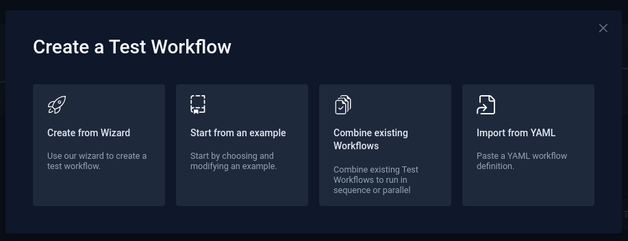

# Dashboard TESTKUBE

Abrir no Browser de sua preferência...http://localhost:8080/

O administrador nesta demonstração tem o seguinte e-mail e senha: 

> admin@example.com/password

## Login

## Criando conta

## Configurando o primeiro Workflow

## Criando um Workflow de Teste from Wizard

Podemos criar um workflow de algumas maneiras diferentes

- Create from Wizard (um modo interativo)
- Start from an example (a partir de um exemplo)

- [From Wizard](../docs/workflow/wizard.md)
- [From Example](../docs/workflow/example.md)
- [Combine existing Workflows]()
- [Import from YAML](../docs/workflow/from-yaml.md)
- [Change Workflow](../docs/testkube/change-workflow.md)
- [Verificando consumo do Cluster](../prometheus-grafana-eks/consumo.md)