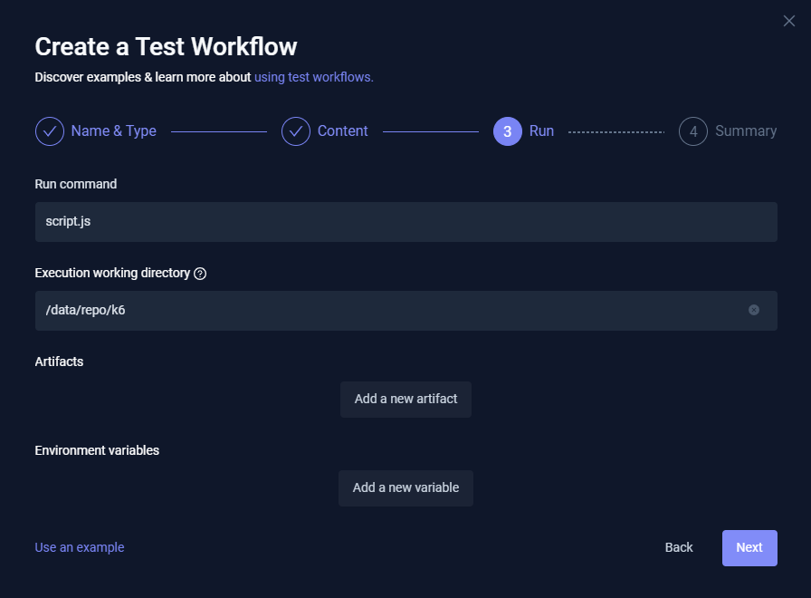

# TESTKUBE

## Dashboard

[Testkube local](http://localhost:8080/)

<div align="center">


</div>

O administrador nesta demonstração tem o seguinte e-mail e senha: 

> admin@example.com/password

## Login

<div align="center">


</div>

## Criando conta

<div align="center">


</div>

## Configurando o primeiro Workflow


<div align="center">


</div>

## Criando o Workflow de Teste

<div align="center">


</div>

## Criando o teste

<div align="center">


</div>

## Configurando a ferramenta que será utilizada no teste

- Name: test.k6.io
- Labels: testkube.io/name:k6
- Template: k6
- K6 Version

Conforme a imagem abaixo:

<div align="center">


</div>

## Criando a configuração que será utilizada no test

- Git, utilizando um repositório com o script de teste.
- File, indicando o arquivo com o script de teste.
- String, com o script de teste.

<div align="center">


</div>


### GIT

<div align="center">


</div>

data/repo

<div align="center">



</div>

Conteúdo do Summary, o que será excutado. Im portante conferir

<div align="center">


</div>

```bash
kind: TestWorkflow
apiVersion: testworkflows.testkube.io/v1
metadata:
  name: test.k6.io
  namespace: testkube
  labels:
    testkube.io/name: k6
spec:
  use:
  - name: official--k6--v1
    config:
      run: k6 run script.js
  content:
    git:
      uri: https://github.com/horadoqa/scripts-k6
      revision: main
      usernameFrom:
        secretKeyRef:
          name: <computed>
          key: <computed>
      tokenFrom:
        secretKeyRef:
          name: <computed>
          key: <computed>
      paths:
      - /k6/script.js
  container:
    workingDir: /data/repo/k6

```

## Create & Run

Executar o teste

### FILE

### STRING

<div align="center">


</div>

## Executando o teste

<div align="center">


</div>


## Verificando o resultado do teste
<div align="center">


</div>


## Verificando a execução do teste

<div align="center">


</div>

## Alterando o WORKFLOWS

Alterar o Content, inserindo mais VUs, aumentando o tempo de execução


<div align="center">


</div>


```bash
kind: TestWorkflow
apiVersion: testworkflows.testkube.io/v1
metadata:
  name: k6-sample
  namespace: testkube
  labels:
    docs: example
spec:
  content:
    files:
    - path: /data/example.js
      content: |-
        import http from 'k6/http';
        import { sleep } from 'k6';
        export const options = {
          vus: 10,
          duration: '60s',
        };
        export default function () {
          http.get('http://test.k6.io');
          sleep(1);
        }
  steps:
  - name: Run Tests
    workingDir: /data
    run:
      image: grafana/k6:0.49.0
      env:
      - name: K6_WEB_DASHBOARD
        value: "true"
      - name: K6_WEB_DASHBOARD_EXPORT
        value: k6-test-report.html
      args:
      - run
      - example.js
    artifacts:
      paths:
      - k6-test-report.html
```

## Executando novamente o teste

<div align="center">


</div>

## Verificando o resultado depois da modificação

<div align="center">


</div>

```
Próximos passos... [Verificando consumo CPU/Memória dos Nodes e Pods](consumo.md)