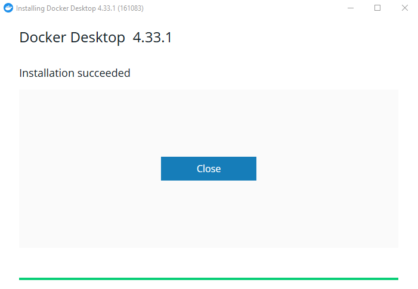
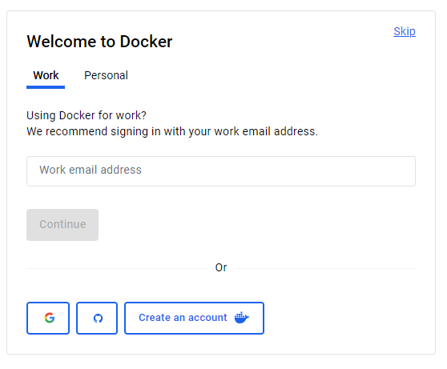
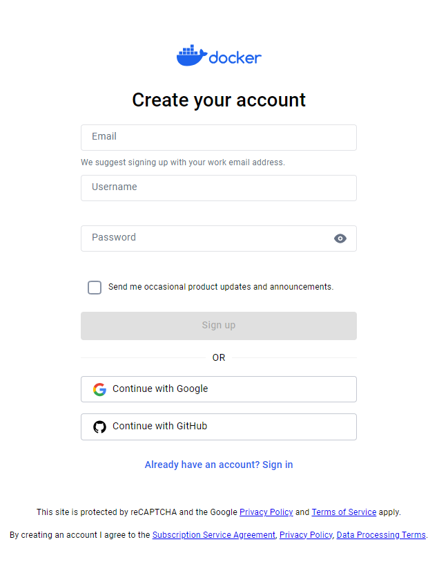
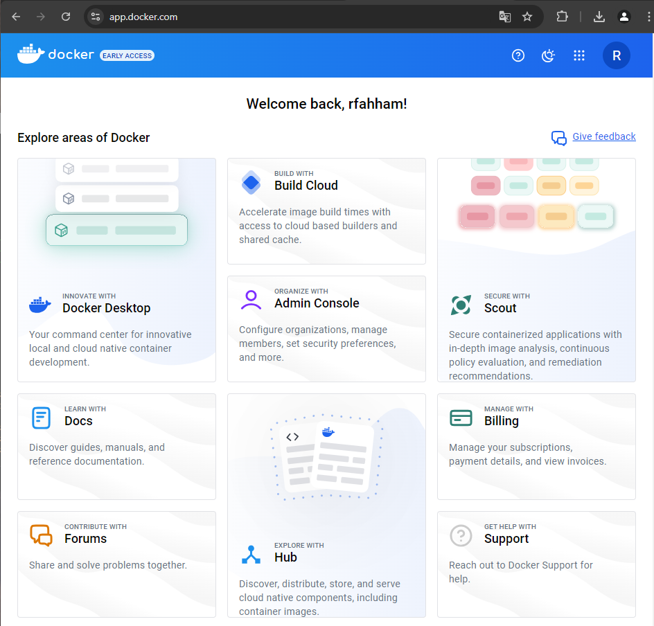
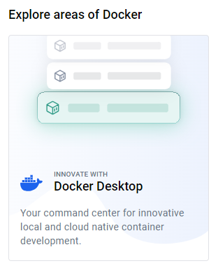
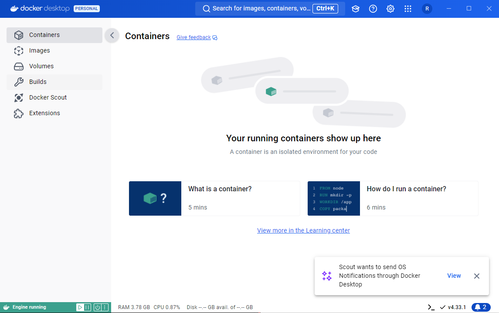

# Docker Desktop

### Fazer o Download
https://www.docker.com/products/docker-desktop/

#### Windows
https://docs.docker.com/desktop/install/windows-install/

### Instalar



### Inicializar o Docker Desktop 

No Windows, botão do Windos + s
Procurar por Docker Desktop

### Criar a conta

<div align="center">



</div>

Será redirecionado para o formulário de criação da conta (Sign Up)

<div align="center">



</div>

<div align="center">



</div>

<div align="center">



</div>

<div align="center">



</div>

### Logar CLI

Este passo é importante para todo o trabalho que seguirá no caso de trabalhar com imagens, pull, build,push via linha de comando. 

```bash
docker login

Log in with your Docker ID or email address to push and pull images from Docker Hub. If you don't have a Docker ID, head over to https://hub.docker.com/ to create one.
You can log in with your password or a Personal Access Token (PAT). Using a limited-scope PAT grants better security and is required for organizations using SSO. Learn more at https://docs.docker.com/go/access-tokens/

Username:
Password:

Login Succeeded
```

Próximo passo... [Instalar kubernetes](../k8s/kubernetes.md)