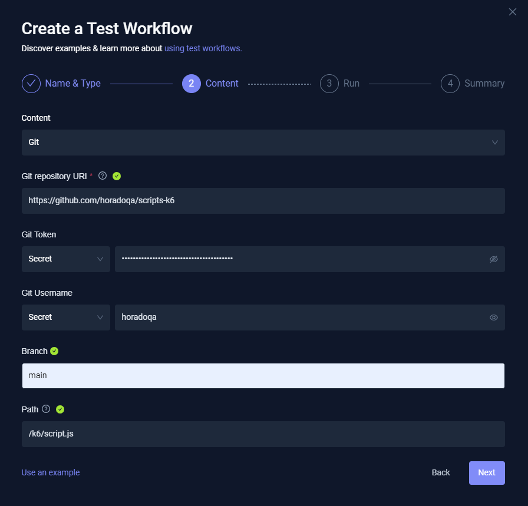
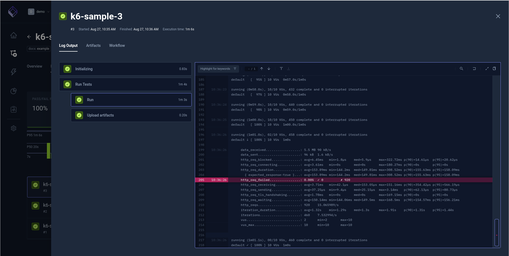

# Configuração do Content com a utilização do GITHUB

<div align="center">



</div>

Definindo o comando que será utilizado para executar o teste e o `/data/repo/` nome do diretório que se encontra o script.

<div align="center">


</div>

Conteúdo do Summary, o que será excutado. Importante conferir...

<div align="center">


</div>

```bash
kind: TestWorkflow
apiVersion: testworkflows.testkube.io/v1
metadata:
  name: test.k6.io
  namespace: testkube
  labels:
    testkube.io/name: k6
spec:
  use:
  - name: official--k6--v1
    config:
      run: k6 run script.js
  content:
    git:
      uri: https://github.com/horadoqa/scripts-k6
      revision: main
      usernameFrom:
        secretKeyRef:
          name: <computed>
          key: <computed>
      tokenFrom:
        secretKeyRef:
          name: <computed>
          key: <computed>
      paths:
      - /k6/script.js
  container:
    workingDir: /data/repo/k6

```

## Resultado do teste

<div align="center">



</div>
