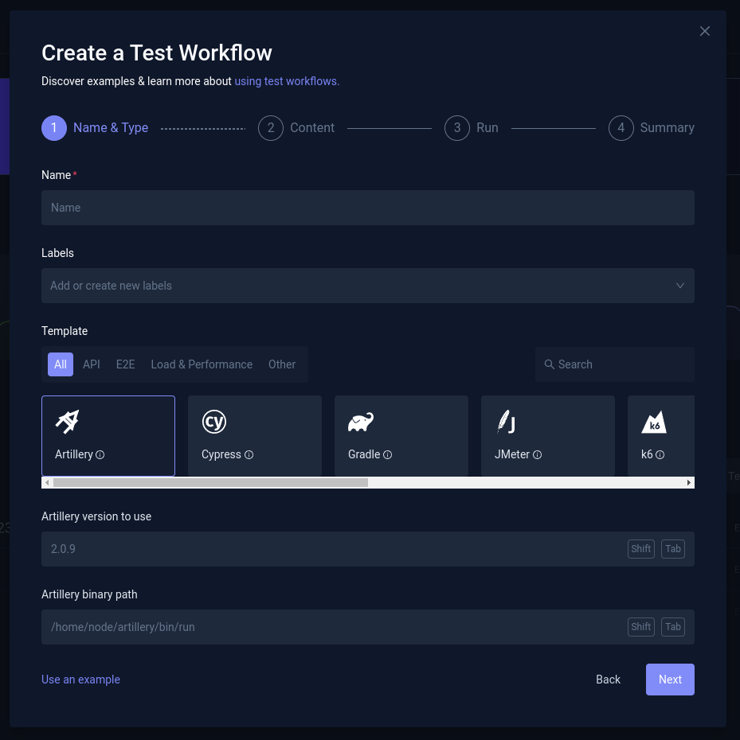
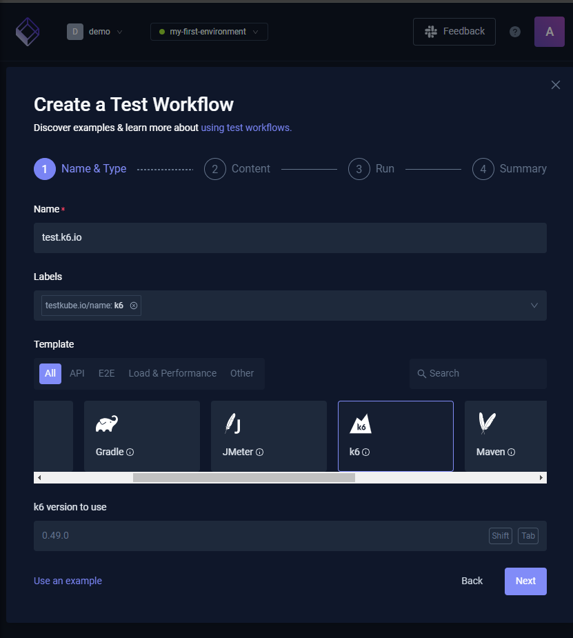
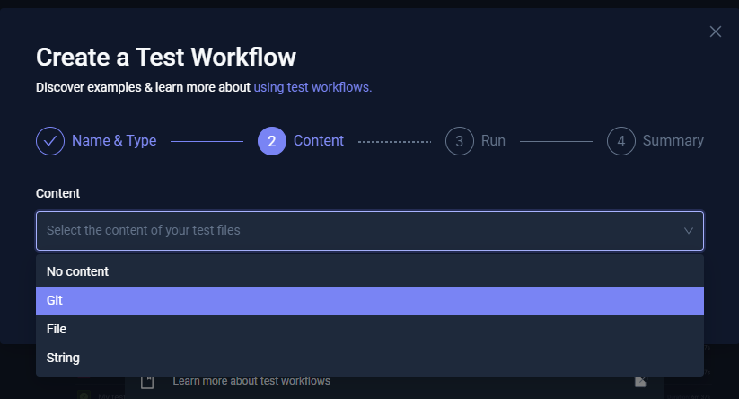

# Criando um Workflow from Wizard

## Configurando a ferramenta que será utilizada no teste `k6`

- Name: test.k6.io
- Labels: testkube.io/name:k6
- Template: k6
- K6 Version to use: 0.49.0

Conforme a imagem abaixo:

## Defininto o `Content` que será utilizado no teste, a forma que o Testekube irá executar o teste

- `Git`, utilizando um repositório com o script de teste.
- `File`, indicando o arquivo com o script de teste.
- `String`, com o script de teste.

- Configuração utilizando o [GITHUB](./git.md)

- Configuração utilizando o [FILE](./file.md)

- Configuração utilizando o [STRING](./string.md)
